# 项目介绍

本系统有前端系统、后端系统构成，主要技术架构为vue+php+mysql。

前端系统使用vue2作为主体框架，使用了开源组件vuex,vueRoutr,element-ui, vue2-ace-editor。

后端系统使用mysqli扩展连接数据库，dom扩展获取页面信息。

数据库名称为oneoj 用户名密码为admin 123456

Mysql数据库中设计了四张表，分别为oj_problem（题目表）、oj_problem_submit（题目提交表）、oj_user（用户表）、oj_user_info（用户详情表)，表结构如下如所示：

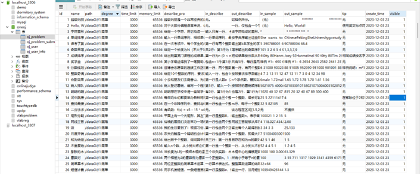
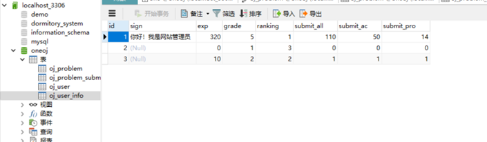
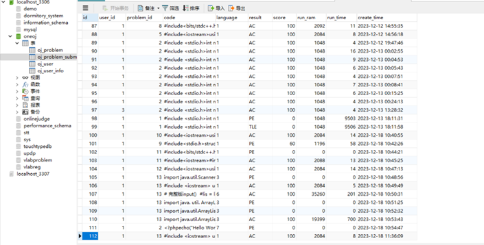
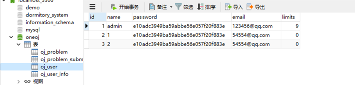

# 功能描述

##   

## 一 登录注册功能

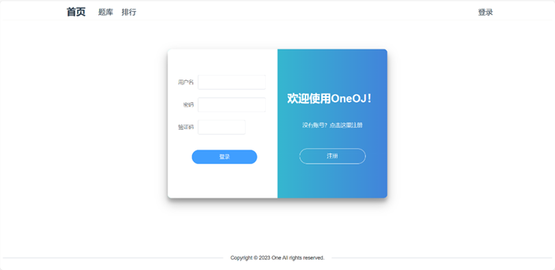

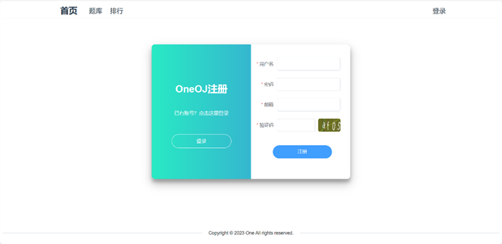

## 二 题目查看

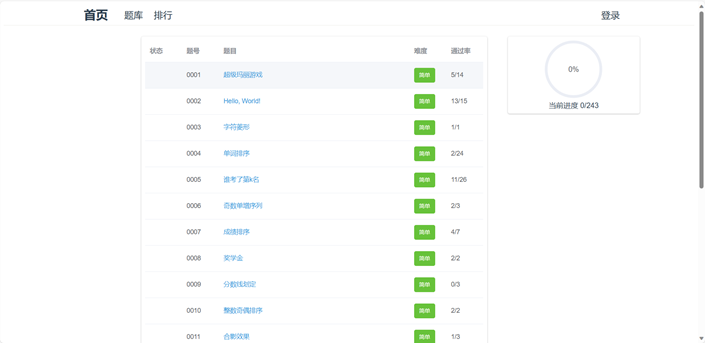

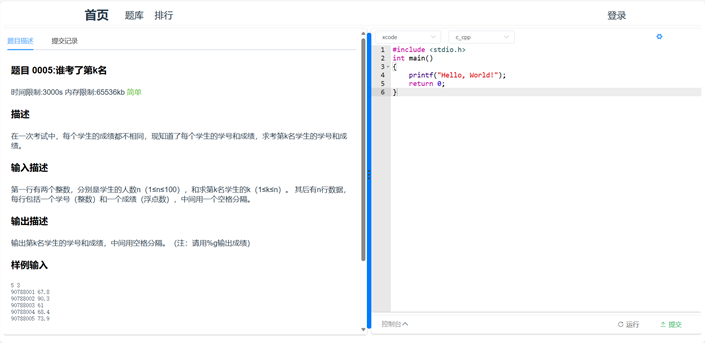

## 三 代码提交功能

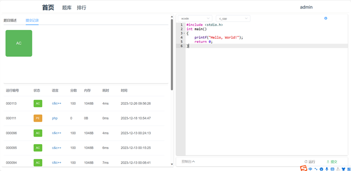
 

## 四 用户界面查看

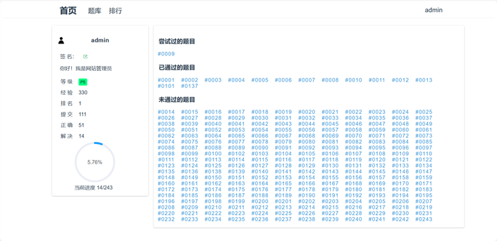

## 五 排行界面查看 

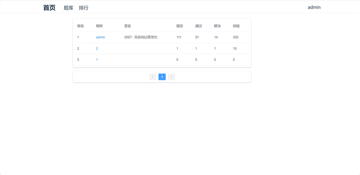

 

 

 

 